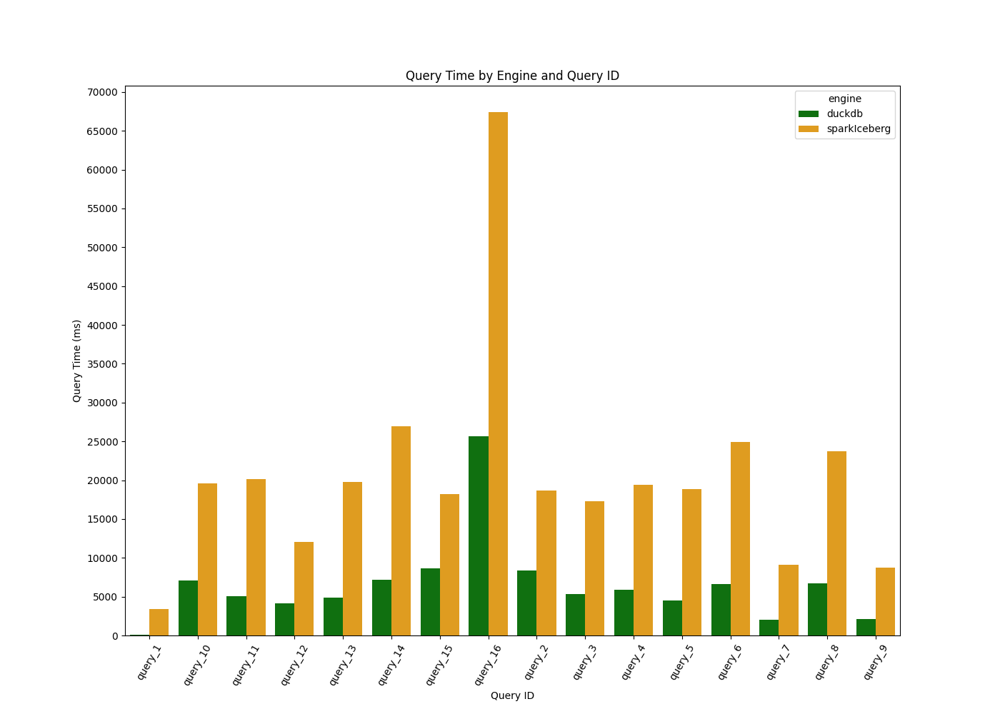
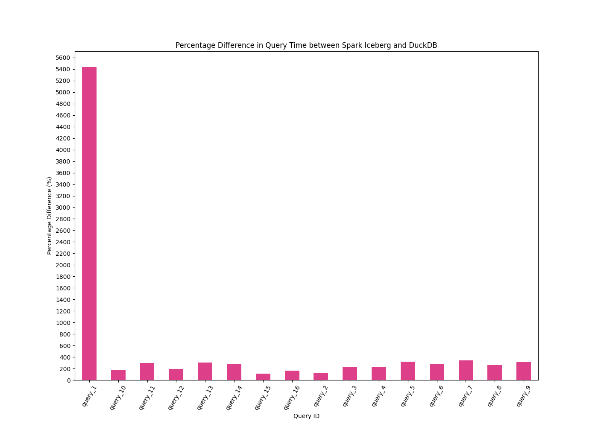
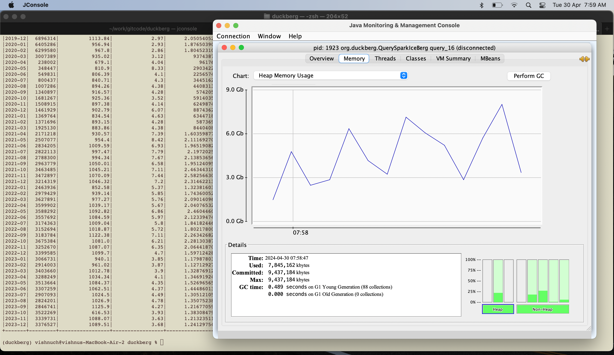

# duckberg
duckDB vs Spark SQL on Apache Iceberg for 1 Billion rows - Nyc yellow taxi dataset.

## Introduction

This project aims to compare the performance of duckDB and Spark SQL on Apache Iceberg for the Nyc yellow taxi dataset. 
The dataset is available on the [NYC Taxi & Limousine Commission website](https://www.nyc.gov/site/tlc/about/tlc-trip-record-data.page). 
The dataset contains information about taxi trips in New York City, including pick-up and drop-off times, locations, trip distances, and fares. 
The dataset is available in CSV format and can be downloaded from the website.

## Dataset

The dataset contains the following columns:
```
root
|-- VendorID: long (nullable = true)
|-- tpep_pickup_datetime: timestamp (nullable = true)
|-- tpep_dropoff_datetime: timestamp (nullable = true)
|-- trip_distance: double (nullable = true)
|-- store_and_fwd_flag: string (nullable = true)
|-- PULocationID: long (nullable = true)
|-- DOLocationID: long (nullable = true)
|-- payment_type: long (nullable = true)
|-- fare_amount: double (nullable = true)
|-- extra: double (nullable = true)
|-- mta_tax: double (nullable = true)
|-- tip_amount: double (nullable = true)
|-- tolls_amount: double (nullable = true)
|-- total_amount: double (nullable = true)
|-- airport_fee: integer (nullable = true)
|-- passenger_count: long (nullable = true)
|-- congestion_surcharge: double (nullable = true)
|-- improvement_surcharge: double (nullable = true)
|-- RatecodeID: long (nullable = true)
```

### Dataset size on disk

The dataset used, is of Parquet format & is approximately 16 GB in size for the years 2023-2014 (inclusive).
It contains approximately 1Billion rows. 1 file was corrupt & was removed from the dataset, hence
the number of rows for the benchmark reduced to 0.88 Billion.

## Setup

I Used the following setup for the benchmark:

- 10 years Data was pulled for the years 2023-2014 (inclusive) from the NYC Taxi & Limousine Commission website.
- Data was stored on local file system in parquet format.
- 1 MacBook Air (M1, 2020), 16GB RAM, 512 GB Flash Storage, macOS Monterey, 8core (4 performance and 4 efficiency)
- duckDB was run in python 3.10.0, duckDB read parquet stored in local file system
- Spark was run in java in spark local mode, with iceberg warehouse catalog pointing to local file system
  - Data was loaded (~301sec) into iceberg warehouse tables before running benchmark. loading time was excluded in benchmark.
- 9G of memory was allocated to both duckDB & Spark.
- All cores were used for both duckDB & Spark.

## Benchmark Queries

There were a total of 16 queries.
Some were taken from this [benchmark](https://altinity.com/blog/clickhouse-and-redshift-face-off-again-in-nyc-taxi-rides-benchmark) 
and some were taken from  [here](https://towardsdatascience.com/duckDB-and-aws-how-to-aggregate-100-million-rows-in-1-minute-3634eef06b79)
and rest written by me. You can check the queries in the `queries.py` file.

## Results

Not surprisingly, duckDB outperformed Spark SQL-Iceberg on all queries.

Note: 
- Data load time, Program startup times were not considered.
  - duckDB loading time was 0sec, as it read from files directly.
  - Apache Iceberg data loading was a 1 time job and recorded a time of ~300sec.
- Only the query execution times were considered.

If startup times were to be considered, duckDB would outperform Spark Sql on Iceberg by even larger margins.



The % difference/change from duckDb to Spark SQL on Iceberg was:
- at a Minimum ~200x 
- at a Maximum was 5000x



## Thoughts for Technical Debate

1. Why all the data resided on local disk not s3/azure blob storage ?
2. Its unfair as Spark SQL was run in local mode and not a cluster mode i.e. more than 1 node.

### My Side 

1. 
The compressed parquet dataset size for 1Billion was 16GB. 
Any node on ec2/azure/gcp can handle 16GB disk.
Downloading the data to disk (say aws s3 cp) + reading from local file system is faster than reading from s3/blob storage.
Hence this pattern is feasible.
Feel free to read from s3/azure blob storage.

2. 
The longest running query was query16. 
The peak memory usage for spark was about ~8.5GB, so it well within limits (I could have made Xmx=10g for safety).
When it can complete on 1 node, why run on cluster ?
You might think 'So y use Spark for 16G small dataset, This benchmark is not valid?'.
Spark on local mode is a well known processing method. People move to clusters when limits are breached without no code changes.
Dataset may be small on disk i.e. compressed parquet. Uncompressed it would be 32GB,
You might think 'Still small! Not a case for Spark?'.
Either way(whether we go for cluster or its a small dataset), you are edging out Spark on Iceberg on this 1 Billion row dataset :)
Perhaps polars, is a better competitor to duckDB for this benchmark ? 
Ps: With Spark local mode, Shuffling gets eliminated.



## So why would I go for duckDB ?

Cost is the hidden/overlooked dimension to data engineering. Cost based engineering is the new OIL.

## Like me ? Need a Consultation

Happy to help you with your data engineering needs. 
Reach out to me at [LinkedIn](https://www.linkedin.com/in/213vishnu/) 
or [Twitter](https://twitter.com/bytespireio)
or [Twitter](https://twitter.com/sweetweet213)

Ps: i am the Chief Inspiration officer at [Bytespire.io](https://bytespire.io)

[Buy me a coffee?](https://buymeacoffee.com/techteachr)
